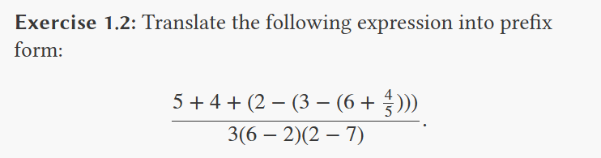

# SICP

## Exercises from Chapter 1

Exercise 1.1: Below is a sequence of expressions. What is the result printed by the interpreter in response to each expression? Assume that the sequence is to be evaluated in the order in which it is presented.

```scheme
10
(+ 5 3 4)
(- 9 1)
(/ 6 2)
(+ (* 2 4) (- 4 6))
(define a 3)
(define b (+ a 1))
(+ a b (* a b))
(= a b)
(if (and (> b a) (< b (* a b)))
    b
    a)
(cond ((= a 4) 6)
      ((= b 4) (+ 6 7 a))
      (else 25))
(+ 2 (if (> b a) b a))
(* (cond ((> a b) a)
         ((< a b) b)
         (else -1))
   (+ a 1))
```

Answer

```scheme
10
12
8
3
6
3
()
()
19
false
4
16
6
16
```

----


```scheme
( / (
    + 5 4 (
        - 2 (- 3 (+ 6 (/ 4 5)))    
        )
    ) 
    (
        * 3 (- 6 2) (- 2 7)
    )
)
```
----
Exercise 1.3: Define a procedure that takes three numbers as arguments and returns the sum of the squares of the two larger numbers.

```scheme
(define (square (* x x)))
(define (square_sum x y) (+ (square x) (square y)))
(define (sum_of_largest x y z) (
    cond (
        ((and (>= x y) (>= y z)) (square_sum x y))
        ((and (>= y x) (>= x z)) (square_sum x y))
        ((and (>= z y) (>= y x)) (square_sum z y))
        ((and (>= y z) (>= z x)) (square_sum z y))
        ((and (>= x z) (>= z y)) (square_sum x z))
        ((and (>= z x) (>= x y)) (square_sum x z))
    )
))
```

----
Exercise 1.4: Observe that our model of evaluation allows for combinations whose operators are compound expressions. Use this observation to describe the behavior of the following procedure:

```scheme
(define (a-plus-abs-b a b)
  ((if (> b 0) + -) a b))
```

If b is greater than 0, it performs + a b, if not, - a b.

----
Exercise 1.5: Ben Bitdiddle has invented a test to determine whether the interpreter he is faced with is using applicative-order evaluation or normal-order evaluation. He defines the following two procedures:

```scheme
(define (p) (p))

(define (test x y) 
  (if (= x 0) 
      0 
      y))
```

Then he evaluates the expression

```scheme
(test 0 (p))
```

What behavior will Ben observe with an interpreter that uses applicative-order evaluation? What behavior will he observe with an interpreter that uses normal-order evaluation? Explain your answer. (Assume that the evaluation rule for the special form if is the same whether the interpreter is using normal or applicative order: The predicate expression is evaluated first, and the result determines whether to evaluate the consequent or the alternative expression.)

----
