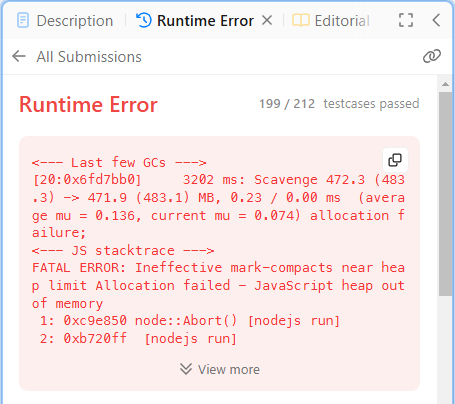
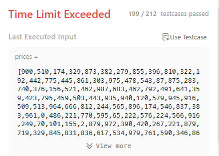

My first solution

```js
    /**
     * @param {number[]} prices
     * @return {number}
     */
    var maxProfit = function(prices) {
        const possibleResults = new Map();
        prices.forEach((buyValue, buyDayIndex) => {
            buyDayIndex += 1;
            const nextDays = prices.slice(buyDayIndex);
            const dayMap = new Map();
            nextDays.forEach((sellValue, sellDayIndex) => {
                sellDayIndex += 1;
                const transaction = sellValue - buyValue; 
                const isProfit = transaction > 0;
                if(isProfit) dayMap.set(buyDayIndex + sellDayIndex, transaction);
            })
            if(dayMap.size > 0) possibleResults.set(buyDayIndex, dayMap);
        });
        let bestValue = 0;
        let bestDay = 0;
        possibleResults.forEach((sellDayMap, buyDay) => {
            sellDayMap.forEach((sellValue, sellDay) => {
                if(sellValue > bestValue) bestValue = sellValue, bestDay = sellDay;
            })
        })
        return bestValue;
    };
```



Second attempt

```js
    var maxProfit = function(prices) {
        let bestValue = 0;
        let bestDay = 0;
        prices.forEach((buyValue, buyDayIndex) => {
            buyDay = buyDayIndex + 1;
            for(let sellDayIndex = buyDayIndex + 1; sellDayIndex < prices.length; sellDayIndex++) {
                sellDay = sellDayIndex + 1;
                sellValue = prices[sellDayIndex];
                const transaction = sellValue - buyValue; 
                const isProfit = transaction > 0;
                if(isProfit && transaction > bestValue) bestValue = transaction, bestDay = sellDay;
            }
        });
        return bestValue;
    };
```



Final Solution

```js
var maxProfit = function(prices) {
    let lowestPrice = prices[0];
    let bestProfit = 0;

    for(let sellDayIndex = 1; sellDayIndex < prices.length; sellDayIndex++) {
        const todaySellValue = prices[sellDayIndex];
        const yesterdaySellValue = prices[sellDayIndex - 1];

        if(todaySellValue > yesterdaySellValue) {
            const transaction = todaySellValue - lowestPrice;
            bestProfit = Math.max(bestProfit, transaction);
        }
        else lowestPrice = Math.min(lowestPrice, todaySellValue);
        
    }
    return bestProfit;
};
```
 