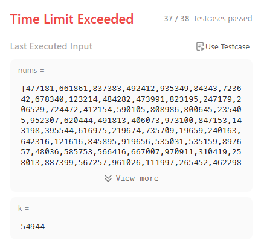

# Leetcode 189: Rotate Array

## My first solution

The first solution that I thought was simply do a foor loop replacing the elements from left to right and reassign the first element to the last. Something like this

```js
    const lastNum = nums[nums.length - 1];
    for(let i = nums.length - 2; i >= 0; i -= 1) {
        nums[i + 1] = nums[i];
    }
    nums[0] = lastNum;
```

This was my thought proccess

1. I have to loop through from right to left to reassign the elements
2. I cannot start from the last one as there is nothing to "grab" from the right
3. I will loop using the penultimate index and access the index + 1 to reassign the current value
4. I have to save the last element somewhere to put in the first index
5. I will save the lastNumber in a temporary variable, loop from left to right and them reassign the first element value

then, simply apply this k times to achieve the desired position.

```js
var rotate = function(nums, k) {
    for(let counter = 0; counter < k; counter += 1) {
        const lastNum = nums[nums.length - 1];
        for(let i = nums.length - 2; i >= 0; i -= 1) {
            nums[i + 1] = nums[i];
        }
        nums[0] = lastNum;
    }
};
```

When I tried the base test cases it worked!! but when I submitted the solution it passed 37/38 cases. the missing case was throwing a *Time limited Exceed* exception because of its large input array and oddly high number of rotations.


After resubmitting a few times hoping to pass, I realized that there was a problem with the time complexity of this algorithm.
It's not a reliable way (Someday I will write a micro post about this), but you can measure the complexity of an algorithm by checking the number of loops you have and counting how many times your algorithm is going to iterate given different inputs.

```js
var rotate = function(nums, k) {
    for(let counter = 0; counter < k; counter += 1) {
        /**/
    }
};
```

means that this code will run at least `k` times with `k` being the number of times the matrix is going to be rotated.

```js
    const lastNum = nums[nums.length - 1];
    for(let i = nums.length - 2; i >= 0; i -= 1) {
        nums[i + 1] = nums[i];
    }
    nums[0] = lastNum;
```

means that will run at least the number of elements in `nums` minus 1

Considering the complete algorithm, it will run `(numberOfElements - 1) * k` times, or in big O notation, O(N * K). This is not going to be a problem in smaller arrays, but as the input grows, the number of rotations can create a catastrophic number of iterations.
Leetcode's failed example was a `100000` lengh array that had to be rotated `54944` times, which represents `5494400000` iterations!

## Better solution (in terms of time complexity)

To be honest, I couldn't figure out this solution on my own, I had to search how to efficiently rotate arrays in order to perform in a less expensive way, so now I will explain the solution that I found using my own words.

```js
const rotateArray = function(nums, k) {

  // reverse helper function
  function reverse(arr, start, end) {
    while (start < end) {
      [arr[start], arr[end]] = [arr[end], arr[start]];
      start++;
      end--;
    }
  }

  k %= nums.length;

  reverse(nums, 0, (nums.length - 1));
  reverse(nums, 0, (k - 1));
  reverse(nums, k, (nums.length - 1));

  return nums;
}
```

At first I didn't understood reversing the array three times could rotate it but after writing down on my paper some examples it made a lot of sense!

Consider `[1,2,3,4,5]` our input and `2` the number of times to rotate

first, reverse the whole array

`[5,4,3,2,1]`

now, reverse from the first element to the number of desired rotations minus 1

`[5,4,3,2,1]`

notice that `k === 2` and `2 - 1 === 1`, so we do nothing.

now, reverse from k to the end of the array

`[5,1,2,3,4]`

and that's it, doing step by step with smaller inputs make it easier to figure it out how this works.

### Time complexity of this solution

Using the "number of loops" trick, It's possible to see the reverse function running three times.

1. In the first reverse call, it will scan the whole array (n)
2. In the second call, it will run through the start to the number of expected rotations minus 1 (n - k)
3. In the third call, it will run through the number of expected rotations to the end (|k - n|)

Thinking about the worst possible case,k being `1` means the whole array will be accessed three times, so our complexity now is O(N*3)!
